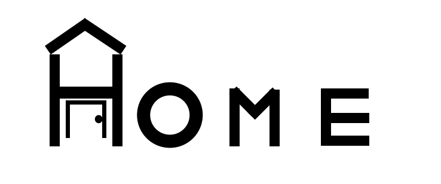

<center></img> </center>
<ul></ul>
<b>FOÏL Home, which is a Smart Home Automation System that not only control lights and air conditioning, it also can control most other things in the house such as turning on a faucet, flushing toilets, automatically opening the front door, and much more. The goal for this project is to help people with intellectual and developmental disabilities, as well as more accessibility.</b>

### Table of Contents
- [Installation](#installation)
- [Manual Configurations](#manual-configurations)
    - [visudo](#visudo)
    - [Change Directory of the Localhost on Apache Server](#change-directory-of-the-localhost-on-apache-server)

## Installation

<b> Run the install.sh file and grab a cup of coffee, or take a break. This file will install the FOIL-Home Software. Throughout the installation, there will be some manual configurations that are required for FOIL-Home to work properly, which is shown under Manual Configuration. Note: The install.sh file may not be stable enough yet to use it to installing the FOIL-Home Software. The install.sh file content will be subjected to change over the beta update period.   </b>
```bash
sh install.sh
```


## Manual Configurations
#### visudo 
<b> In visudo, there are some additions and permissions in-order for FOIL-Home to work properly. This file will open in any type of editor that is used by default for visudo.  </b>
```bash
## Under the "includedir /etc/sudoers.d" section, type these commands :
www-data ALL=NOPASSWD:/sbin/shutdown
www-data ALL=NOPASSWD:/sbin/shutdown-h
www-data ALL=NOPASSWD:/sbin/sleep
www-data ALL=NOPASSWD:/sbin/halt
```


#### Change Directory of the Localhost on Apache Server 
<b> Once you exit the editor, it will take you to the "000-default.conf" file, which is file where you can change the directory of the localhost. </b>
```bash
## Under the "ServerAdmin webmaster@localhost, next to "DocumentRoot"
## Change directory to
DocumentRoot /var/www/html/FOIL-Home/
```